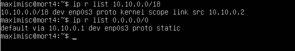
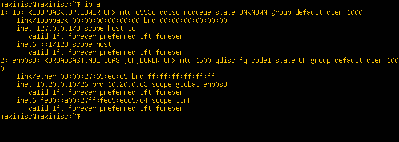
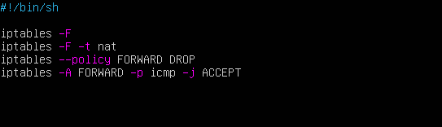

# Сети в Linux

Настройка сетей в Linux на виртуальных машинах.


## Contents

1. [Chapter I](#chapter-i) \
   1.1. [Инструмент ipcalc](#part-1-инструмент-ipcalc) \
   1.2. [Статическая маршрутизация между двумя машинами](#part-2-статическая-маршрутизация-между-двумя-машинами) \
   1.3. [Утилита iperf3](#part-3-утилита-iperf3) \
   1.4. [Сетевой экран](#part-4-сетевой-экран) \
   1.5. [Статическая маршрутизация сети](#part-5-статическая-маршрутизация-сети) \
   1.6. [Динамическая настройка IP с помощью DHCP](#part-6-динамическая-настройка-ip-с-помощью-dhcp) \
   1.7. [NAT](#part-7-nat) \
   1.8. [Допополнительно. Знакомство с SSH Tunnels](#part-8-дополнительно-знакомство-с-ssh-tunnels)

## Chpater I

## Part 1. Инструмент ipcalc

**== Задание ==**

##### Поднимем виртуальную машину (далее -- ws1)

#### 1.1. Сети и маски

##### Определить и записать в отчёт:

##### 1) Адрес сети *192.167.38.54/13*

##### 2) Перевод маски *255.255.255.0* в префиксную и двоичную запись, */15* в обычную и двоичную, *11111111.11111111.11111111.11110000* в обычную и префиксную

##### 3) Минимальный и максимальный хост в сети *12.167.38.4* при масках: */8*, *11111111.11111111.00000000.00000000*, *255.255.254.0* и */4*

#### 1.2. localhost

##### Определи и запиши в отчёт, можно ли обратиться к приложению, работающему на localhost, со следующими IP: *194.34.23.100*, *127.0.0.2*, *127.1.0.1*, *128.0.0.1*

#### 1.3. Диапазоны и сегменты сетей

##### Определи и запиши в отчёт:

##### 1) Какие из перечисленных IP можно использовать в качестве публичного, а какие только в качестве частных: *10.0.0.45*, *134.43.0.2*, *192.168.4.2*, *172.20.250.4*, *172.0.2.1*, *192.172.0.1*, *172.68.0.2*, *172.16.255.255*, *10.10.10.10*, *192.169.168.1*

---

**== Выполнение задания ==**

#### 1.1 **Сети и маски**

1) Адрес сети `192.167.38.54/13` \
  Network `192.160.0.0/13` \
  

2) Пепервод масок
- `255.255.255.0` в префиксную и двоичную запись \
  
- `/15` в обычную и двоичную \
  
- `11111111.11111111.11111111.11110000` в обычную и префиксную \
  

3) Минимальный и максимальный хост в сети
- netmask `/8` \

- netmask `11111111.11111111.00000000.00000000` \
  
- netmask `255.255.254.0` \
  
- netmask `/4` \
  

---

#### 1.2 **localhost**

> Адреса localhost связана с использованием IP-адреса из диапазона `loopback`.
Обычно этот диапазон адресов ограничен диапазоном **`127.0.0.0/8`** \
`194.34.23.100`, `128.0.0.1` - нельзя обратиться к приложению \
`127.0.0.2`, `127.1.0.1` - можно обратиться к приложению

---

#### 1.3 **Диапазоны и сегменты сетей**

1. Диапазоны локальных сетей \


```
Частные IP: `10.0.0.45`, `192.168.4.2`, `172.20.250.4`, `172.16.255.255`, `10.10.10.10`
Публичные IP: `134.43.0.2`, `172.0.2.1`, `192.172.0.1`, `172.68.0.2`, `192.169.168.1`
```

2. IP-адреса можно использовать: `10.10.0.2`, `10.10.10.10`, `10.10.1.255` \
  

## Part 2. Статическая маршрутизация между двумя машинами

**== Задание ==**

##### Подними две виртуальные машины (далее -- ws1 и ws2)

##### С помощью команды `ip a` посмотри существующие сетевые интерфейсы

- В отчёт помести скрин с вызовом и выводом использованной команды.

##### Опиши сетевой интерфейс, соответствующий внутренней сети, на обеих машинах и задать следующие адреса и маски: ws1 - *192.168.100.10*, маска */16*, ws2 - *172.24.116.8*, маска */12*

- В отчёт помести скрины с содержанием изменённого файла *etc/netplan/00-installer-config.yaml* для каждой машины.

##### Выполни команду `netplan apply` для перезапуска сервиса сети

- В отчёт помести скрин с вызовом и выводом использованной команды.

#### 2.1. Добавление статического маршрута вручную

##### Добавь статический маршрут от одной машины до другой и обратно при помощи команды вида `ip r add`

##### Пропингуй соединение между машинами

- В отчёт помести скрин с вызовом и выводом использованных команд.


#### 2.2. Добавление статического маршрута с сохранением
##### Перезапусти машины

##### Добавь статический маршрут от одной машины до другой с помощью файла *etc/netplan/00-installer-config.yaml*

- В отчёт помести скрин с содержанием изменённого файла *etc/netplan/00-installer-config.yaml*.

##### Пропингуй соединение между машинами

- В отчёт помести скрин с вызовом и выводом использованной команды.

---

**== Выполнение задания==**

- Просмотр существующих сетевых интерфейсов командой `ip a` \


- Сетевые интерфейсты с указанными адресами и масками \

- Перезапуск сервиса сети \


---

#### 2.1. Добавление статического маршрута вручную

- Добавление статического маршрута командой `ip r add <ip-адрес> via <ip-адрес>` \


---

#### 2.2. Добавление статического маршрута с сохранением

- Добавление статического маршрута с сохранением \


## Part 3. Утилита **iperf3**

#### 3.1. Скорость соединения

##### Переведи и запиши в отчёт: 8 Mbps в MB/s, 100 MB/s в Kbps, 1 Gbps в Mbps

> 8 Mbps = 1 MB/s \
100 MB/s = 819200 Kbps \
 1 Gbps = 1024 Mbps

---

#### 3.2. Утилита **iperf3**

##### Измерь скорость соединения между ws1 и ws2

- Измерение скорости соединения


## Part 4. Сетевой экран

#### 4.1. Утилита **iptables**

- Содержания файлов `/etc/firewall.sh` \

- Запуск файлов `/etc/firewall.sh` \

> iptables обрабатывает правила в порядке их написания. Если правило запрета находиться выше оно срабатывает, а правило разрешения находящиеся ниже нет. Следовательно 1ая машина не пингуется, а 2ая пингуется.

---

#### 4.2. Утилита **nmap**

- Проверка запуска хоста машины


## Part 5. Статическая маршрутизация сети

#### 5.1. Настройка адресов машин

- Настройка и проверка адресса машины **ws11** \


- Настройка и проверка адресса машины **r1** \


- Настройка и проверка адресса машины **r2** \


- Настройка и проверка адресса машины **ws21** \


- Настройка и проверка адресса машины **ws22** \


---

#### 5.2. Включение переадресации IP-адресов

- Для включения переадресации IP, выполним команду на роутерах: \
`sysctl -w net.ipv4.ip_forward=1` \

- При исправлении конфигурации `net.ipv4.ip_forward=1` в файле `/etc/sysctl.conf`
переадресация сохранится после перезагрузки \


---

#### 5.3. Установка маршрута по-умолчанию

- Устанавливаем маршруты default \

- Пингуем с **ws11** роутер **r2** \


---

#### 5.4. Добавление статических маршрутов

- Добавляем в роутеры **r1** и **r2** статические маршруты в файле конфигураций и выводим маршруты командой `ip r` \

- Вывод команд `ip r list 10.10.0.0/[маска сети]` и `ip r list 0.0.0.0/0` \


> Потому что приоритетно выбирается маршрут с более узким диапазоном IP адрессов, как более лучшее решение.

---

#### 5.5. Построение списка маршрутизаторов

- утилитой `traceroute` строим список маршрутизаторов на пути от ws11 до ws21 \


---

#### 5.6. Использование протокола **ICMP** при маршрутизации

- Запускаем на r1 перехват сетевого трафика, проходящего через eth0 с помощью команды `tcpdump -n -i eth0 icmp`, а с ws11 пингуем несуществующий IP \


## Part 6. Динамическая настройка IP с помощью **DHCP**

- Указываем адрес маршрутизатора по-умолчанию, DNS-сервер и адрес внутренней сети в `/etc/dhcp/dhcpd.conf` \

- В файле `/etc/resolv.conf` прописываем `nameserver 8.8.8.8` \

- Перезагружаем службу DHCP `sudo systemctl restart isc-dhcp-server` \

- вызываем команду `ip a` после перезагрузки \

- Пингуем ws22 c ws22 \

- Добовляем MAC-адрес для ws11 \

- Роутер `r1` настраиваем аналогично `r2`, но выдача адресов с привязкой к MAC-адресу для `ws11` \

- В файле `/etc/resolv.conf` прописываем `nameserver 8.8.8.8` после чего также перезагружаем службу DHCP \

- проверяем наличие IP-адреса `ws11` \

- Запросим обновление IP-адреса ws21 командами `sudo dhcp -r` и `sudo dhcp` \


## Part 7. **NAT**

- В файле `/etc/apache2/ports.conf` на ws22 и r1 изменяем `Listen 80` на `Listen 0.0.0.0:80`, делая сервер Apache2 общедоступным \

- запускаем сервер apache2 \

- правила для r2 \


> `iptables -F` - Удаление правил в таблице filter \
`iptables -F -t nat` - Удаление правил в таблице "NAT" \
`iptables --policy FORWARD DROP` - Отбрасывать все маршрутизируемые пакеты

- При запуске с этими правилами, ws22 не должна пинговаться с r1 \

- Разрешить маршрутизацию всех пакетов протокола ICMP для r1 \

- Проверка соединения ws22 c r1 \

- Добавление правил SNAT и DNAT. Проверка соединений ws22 к r1 для SNAT, и r1 к ws22 для DNAT командой `telnet [адрес] [порт]` \


## Part 8. Дополнительно. Знакомство с **SSH Tunnels**
- Воспользоваться Local TCP forwarding с ws21 до ws22, чтобы получить доступ к веб-серверу на ws22 с ws21 \

- Для проверки доступности ws22 c ws21 используем команду `telnet [адрес] [порт]` \

